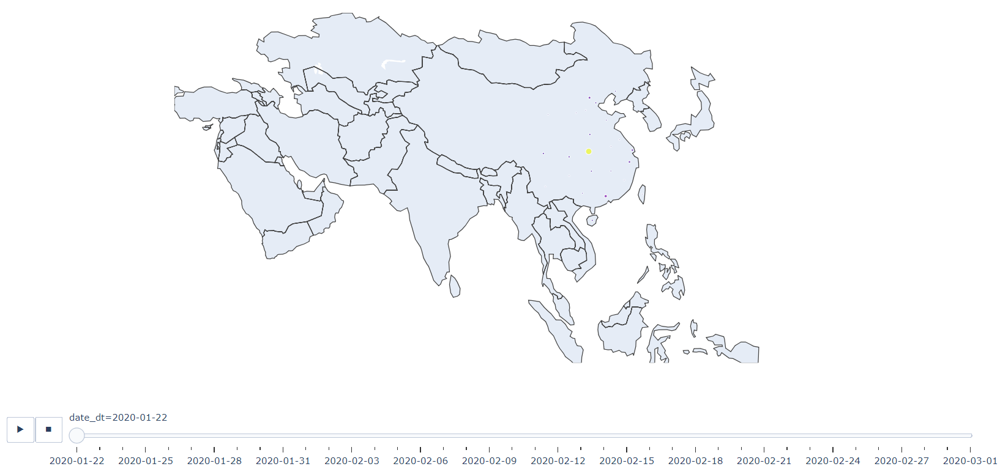

```{r setup, echo=F, purl=F}
knitr::opts_knit$set(root.dir = getwd())
knitr::opts_chunk$set(echo = TRUE, results = 'hide')
knitr::opts_chunk$set(warning = FALSE, message=FALSE)
knitr::opts_chunk$set(out.height="0.5\\textwidth", fig.width=5, fig.height=3, fig.align="center")
```

```{r prepare, echo=F, purl=F}
rm(list=ls())
options(digits=4)
options(scipen=100)
graphics.off()
Sys.setlocale("LC_ALL", "Chinese")
```

# 读取数据及处理
```{python}
import pandas as pd
import numpy as np 

#疫情的确诊数（confirmed）
confirmed = pd.read_csv('./time_series_19-covid-Confirmed.csv')

#治愈数
recovered = pd.read_csv('./time_series_19-covid-Recovered.csv')

#死亡数
deaths = pd.read_csv('./time_series_19-covid-Deaths.csv')

print(confirmed.shape)
print(recovered.shape)
print(deaths.shape)
```

confirmed表里面包含发生疫情的国家，经纬度，以及从2020年1月22日至2020年2月28日的
每日的确诊数；
recovered表则记录了治愈数；deaths表则记录了死亡数。三个表都是（101，42）维，
即114行，42列。

## 查看发生疫情国家

```{python}
countries = confirmed['Country/Region'].unique()
print(countries)
print(countries.shape[0])
```

截止2020.2.28，全世界共有61个国家有新冠肺炎病例。

## 每日所有地区新冠肺炎的确诊数，治愈数，死亡数。

```{python}
all_confirmed = np.sum(confirmed.iloc[:,4:])
all_recovered = np.sum(recovered.iloc[:,4:])
all_deaths = np.sum(deaths.iloc[:,4:])
All = pd.DataFrame({'all_confirmed':all_confirmed,'all_recovered':all_recovered,'all_deaths':all_deaths})
All.to_csv('All.csv')
```

```{r, echo=F}
library(kableExtra) 
library(knitr)
```
```{r All, eval=T, echo=F, results='markup', cache=F}
All<-read.csv("./All.csv")     
kable(All, row.names =F, align = "c", caption="全球每日新冠肺炎数据",
     longtable = TRUE, booktabs = TRUE, linesep  = "")
```


## 中国大陆新冠肺炎的情况
```{python}
last_update='2/28/20' #设置最新数据日期
China_cases=confirmed[['Province/State',last_update]][confirmed['Country/Region']=='Mainland China']
China_cases['recovered']=recovered[[last_update]][recovered['Country/Region']=='Mainland China']
China_cases['deaths']=deaths[[last_update]][deaths['Country/Region']=='Mainland China']
China_cases = China_cases.set_index('Province/State')
China_cases = China_cases.rename(columns = {last_update:'confirmed'})
China_cases.to_csv('Chinacases.csv')
```
```{r Chinacases, eval=T, echo=F, results='markup', cache=F}
Chinacases<-read.csv("./Chinacases.csv")     
kable(Chinacases, row.names =F, align = "c", caption="中国大陆新冠肺炎数据",
     longtable = TRUE, booktabs = TRUE, linesep  = "")
```


## 中国大陆治愈率 VS 死亡率
```{python}
confirmed_china = confirmed[confirmed['Country/Region']=='Mainland China']
confirmed_china = np.sum(confirmed_china.iloc[:,4:])
recovered_china = recovered[recovered['Country/Region'] == 'Mainland China']
recovered_china = np.sum(recovered_china.iloc[:,4:])
deaths_china = deaths[deaths['Country/Region'] == 'Mainland China']
deaths_china = np.sum(deaths_china.iloc[:,4:])
recover_rate = (recovered_china/confirmed_china)*100
recover_rate1=(recover_rate/100).apply(lambda x: format(x, '.2%'))
death_rate = (deaths_china/confirmed_china)*100
death_rate1 = (death_rate/100).apply(lambda x: format(x, '.2%'))
re_de=pd.DataFrame({'recover_rate':recover_rate1,'death_rate':death_rate1})
re_de.to_csv('rede.csv')
```
```{r rede, eval=T, echo=F, results='markup', cache=F}
rede<-read.csv("./rede.csv")     
kable(rede, row.names =F, align = "c", caption="中国大陆治愈率 VS 死亡率",
longtable = TRUE, booktabs = TRUE, linesep  = "")
```

## 其他地区治愈率 VS 死亡率

```{python}
confirmed_others = confirmed[confirmed['Country/Region'] != 'Mainland China']
confirmed_others = np.sum(confirmed_others.iloc[:,4:])
recovered_others = recovered[recovered['Country/Region'] != 'Mainland China']
recovered_others = np.sum(recovered_others.iloc[:,4:])
deaths_others = deaths[deaths['Country/Region'] != 'Mainland China']
deaths_others = np.sum(deaths_others.iloc[:,4:])
other_recover_rate = (recovered_others/confirmed_others)*100
other_recover_rate1=(other_recover_rate/100).apply(lambda x: format(x, '.2%'))
other_death_rate = (deaths_others/confirmed_others)
other_death_rate1 = (other_death_rate/100).apply(lambda x: format(x, '.2%'))
other_re_de=pd.DataFrame({'recover_rate':other_recover_rate1,'death_rate':other_death_rate1})
other_re_de.to_csv('otherrede.csv')

```
```{r otherrede, eval=T, echo=F, results='markup', cache=F}
otherrede<-read.csv("./otherrede.csv")     
kable(otherrede, row.names =F, align = "c", caption="其他地区治愈率 VS 死亡率
",
longtable = TRUE, booktabs = TRUE, linesep  = "")
```


## 世界其他地区疫情数量
```{python}
others = confirmed[['Country/Region',last_update]][confirmed['Country/Region'] != 'Mainland China']
others['recovered'] = recovered[[last_update]][recovered['Country/Region'] != 'Mainland China']
others['death'] = deaths[[last_update]][deaths['Country/Region'] != 'Mainland China']
others_countries = others.rename(columns = {last_update:'confirmed'})
others_countries = others_countries.set_index('Country/Region')
others_countries = others_countries.groupby('Country/Region').sum()
others_countries.to_csv('otherscountries.csv')
```
```{r otherscountries, eval=T, echo=F, results='markup', cache=F}
otherscountries<-read.csv("./otherscountries.csv")     
kable(otherscountries, row.names =F, align = "c", caption="世界其他地区
疫情数量"
,longtable = TRUE, booktabs = TRUE, linesep  = "")
```


# 数据可视化
## 全球疫情变化趋势图
```{python}
import matplotlib.pyplot as plt 
plt.rcParams['font.sans-serif']=['SimHei']#用来正常显示中文标签
plt.rcParams['axes.unicode_minus']=False#用来显示正常负号
plt.figure(figsize=(12,5))
plt.plot(all_confirmed,c='r',label='确诊',marker ='o')
plt.plot(all_recovered,c = 'b',label = '治愈',marker = 'o')
plt.plot(all_deaths,c = 'lime',label = '死亡',marker = 'o')
plt.xticks(rotation=45,size=10)
plt.yticks(size=20)
plt.xlabel('时 间',size = 20)
plt.ylabel('数 目',size = 20)
plt.title('全球疫情变化趋势',size = 30)
plt.legend(loc = "upper left",fontsize = 20)
plt.show()
```
## 中国大陆每个省份的疫情数量图
```{python}
Mainland_china = China_cases.sort_values(by='confirmed',ascending=True)
Mainland_china.plot(kind='barh', figsize=(12,5), color = ['red','blue','lime'], width=1, rot=2)
plt.title('中国大陆各省市疫情数量',size=30)
plt.ylabel('省/市',size=20)
plt.xlabel('数量',size = 20)
plt.show()
```

可以看到，湖北省三项数据高居第一位，且远远高于其他省份。


## 中国大陆治愈率VS死亡率趋势图
```{python}
plt.figure(figsize=(12,5))
plt.plot(recover_rate, color = 'blue', label = '治愈率', marker = 'o')
plt.plot(death_rate, color = 'lime', label = '死亡率', marker = 'o')
plt.title('中国大陆治愈率 VS 死亡率',size=30)
plt.ylabel('数量',size=20)
plt.xlabel('时间',size=20)
plt.xticks(rotation=45,size=10)
plt.yticks(size=15)
plt.legend(loc = "upper left",fontsize = 20)
plt.show()
```

在1月25日-1月31日期间死亡率略高于治愈率，但其他时间段，治愈率远远高于死亡率

## 其他地区治愈率 VS 死亡率趋势图
```{python}
plt.figure(figsize=(12,5))
plt.plot(other_recover_rate, color = 'blue', label = '治愈率', marker = 'o')
plt.plot(other_death_rate, color = 'lime', label = '死亡率', marker = 'o')
plt.title('其他地区治愈率 VS 死亡率',size=30)
plt.ylabel('数量',size=20)
plt.xlabel('时间',size=20)
plt.xticks(rotation=45,size=10)
plt.yticks(size=15)
plt.legend(loc = "upper left",fontsize = 20)
plt.show()
```
## 世界其他地区疫情数量
```{python}
others_countries.sort_values(by = 'confirmed',ascending = True).plot(kind='barh', 
figsize=(20,10), color = ['red','blue','lime'], 
width=1, rot=2)
plt.title('世界其他地区疫情数量', size=30)
plt.ylabel('Country/Region',size = 20)
plt.xlabel('数量',size = 20)
plt.yticks(size=10)
plt.xticks(size=15)
plt.legend(bbox_to_anchor=(0.95,0.95),fontsize = 20)
plt.show()
```

# 绘制疫情地图
## 用folium包绘制

```{python}
# 疫情地图数据
others=confirmed[['Country/Region','Lat','Long',last_update]][confirmed['Country/Region'] != 'Mainland China']
others['recovered'] = recovered[[last_update]][recovered['Country/Region'] != 'Mainland China']
others['death'] = deaths[[last_update]][deaths['Country/Region'] != 'Mainland China']
others_countries = others.rename(columns = {last_update:'confirmed'})
others_countries.loc['94'] = ['Mainland China',30.9756,112.2707,confirmed_china[-1],recovered_china[-1],deaths_china[-1]]
```

```{python}
import folium
world_map = folium.Map(location=[10, -20], zoom_start=2.3,tiles='Stamen Toner')

for lat, lon, value, name in zip(others_countries['Lat'], others_countries['Long'], 
others_countries['confirmed'], others_countries['Country/Region']):
    folium.CircleMarker([lat, lon],
    radius=10,
    popup = ('<strong>Country</strong>: ' + str(name).capitalize() + '<br>'
    '<strong>Confirmed Cases</strong>: ' + str(value) + '<br>'),
     color='red',
     fill_color='red',
     fill_opacity=0.7 ).add_to(world_map)

world_map
world_map.save("wordmap.html")
import webbrowser
webbrowser.open('wordmap.html')
```
```{r fig1,eval=T, echo=F,fig.cap="亚洲地区疫情扩散图",dev="png",results='markup', cache=F}
include_graphics("./wordmap.png")
```

用folium绘制每日疫情扩散地图如图\@ref(fig:fig1)所示。这是一种可交互的地图，可以
随意移动缩放，鼠标点击地图上红点，即可出现地区的疫情信息。

## 用plotly绘制每日疫情扩散地图

```{python}
import plotly.express as px

#确诊数
confirmed = confirmed.melt(id_vars = ['Province/State', 'Country/Region', 'Lat', 'Long'],var_name='date',value_name = 'confirmed') 
#confirmed.head()

#把date列转换成datetime格式
confirmed['date_dt'] = pd.to_datetime(confirmed.date, format="%m/%d/%y")
confirmed.date = confirmed.date_dt.dt.date
confirmed.rename(columns={'Country/Region': 'country', 'Province/State': 'province'}, inplace=True)
#confirmed

#治愈数、死亡数
recovered = recovered.melt(id_vars = ['Province/State','Country/Region', 'Lat', 'Long'],var_name='date',value_name = 'recovered')
recovered['date_dt'] = pd.to_datetime(recovered.date, format="%m/%d/%y")
recovered.date = recovered.date_dt.dt.date
recovered.rename(columns={'Country/Region': 'country', 'Province/State': 'province'}, inplace=True)

deaths = deaths.melt(id_vars = ['Province/State', 'Country/Region', 'Lat', 'Long'],var_name='date', value_name = 'deaths')
deaths['date_dt'] = pd.to_datetime(deaths.date, format="%m/%d/%y")
deaths.date = deaths.date_dt.dt.date
deaths.rename(columns={'Country/Region': 'country', 'Province/State': 'province'}, inplace=True)

#将三种数据合并在一起
merge_on = ['province', 'country', 'date']
all_date = confirmed.merge(deaths[merge_on + ['deaths']], how='left', on=merge_on). \
merge(recovered[merge_on + ['recovered']], how='left', on=merge_on)

Coronavirus_map = all_date.groupby(['date_dt', 'province'])['confirmed', 'deaths',
'recovered', 'Lat', 'Long'].max().reset_index()
Coronavirus_map['size'] = Coronavirus_map.confirmed.pow(0.5)  # 创建实心圆大小
Coronavirus_map['date_dt'] = Coronavirus_map['date_dt'].dt.strftime('%Y-%m-%d')

fig = px.scatter_geo(Coronavirus_map, lat='Lat', lon='Long',scope='asia',
color="size", size='size', hover_name='province',
hover_data=['confirmed', 'deaths', 'recovered'],
projection="natural earth",animation_frame="date_dt",
title='亚洲地区疫情扩散图')
fig.update(layout_coloraxis_showscale=False)
fig.show()
```
```{r fig2,eval=T, echo=F,fig.cap="亚洲地区疫情扩散图",dev="png",results='markup', cache=F}

```

用plotly绘制每日疫情扩散地图如图\@ref(fig:fig2)所示


